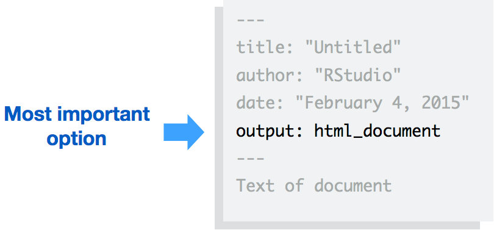
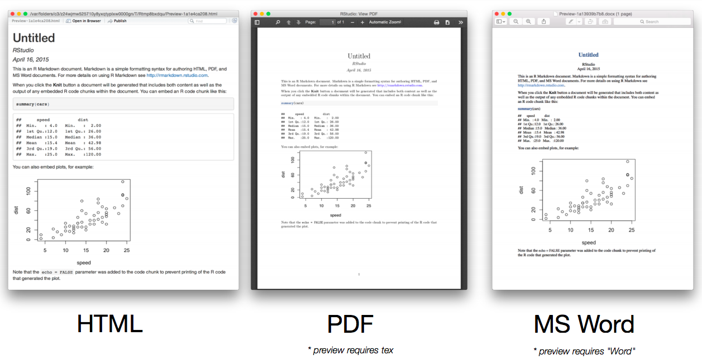

<!-- <style> -->
<!-- body .main-container { -->
<!--     max-width: 50%; -->
<!-- } -->
<!-- </style> -->

<style type="text/css">
body .main-container {
    max-width: 50%;
}
body{ /* Normal  */
      font-size: 14px;
  }
td {  /* Table  */
  font-size: 8px;
}
h1.title {
  font-size: 28px;
  color: DarkRed;
}
h1 { /* Header 1 */
  font-size: 28px;
  color: LightBlue;
}
h2 { /* Header 2 */
    font-size: 22px;
  color: DarkBlue;
}
h3 { /* Header 3 */
  font-size: 18px;
  font-family: "Times New Roman", Times, serif;
  color: DarkBlue;
}
code.r{ /* Code block */
    font-size: 14px;
}
pre { /* Code block - determines code spacing between lines */
    font-size: 14px;
    background: #262525;
}
<!-- pre code.bash { -->
<!--   background: lightyellow; -->
<!-- } -->
</style>


```{r, echo=FALSE, message=FALSE, fig.height=.1}
source("helpers.R")
library(shiny)
library(shiny.semantic)
shiny.semantic::uirender(tagList(sidebar()))
```

[](https://github.com/sindresorhus/awesome)

**Note:** this is personal summary. Some other more strictly updated awsome projects. Inspired by

* [Awesome R](https://awesome-r.com/) 
* [Awesome Machine Learning](https://github.com/josephmisiti/awesome-machine-learning) 


The repository directory to this static html file is built as follows:

```{r, echo = T, message = F}
#source("src/sidebar.R")
shiny.semantic::uirender(tagList(repo_structure()))
```


# Intro

# Basic

## Markdown

## YAML

Der YAML header bestimmt wie das Dokument kompeliert wird. 

```{r, eval = F, echo = T}
---
title: "HTML example"
output: html_document
---
```



Zur Auswahl stehen verschiedene Standardformate. Some code and output. Neben diesen drei Typischen Formaten stehen Erweiterungen für HTML bereit.


# Output Formats

* [Overview of Output Formats](http://rmarkdown.rstudio.com/formats.html)

How things get compiled? When you press the “Knit HTML” button, the R Markdown document is processed by knitr and a plain Markdown document is produced (as well as, potentially, a set of figure files): the R code is executed and replaced by both the input and the output; if figures are produced, links to those figures are included.

The Markdown and figure documents are then processed by the tool pandoc, which converts the Markdown file into an html file, with the figures embedded.



## Flexdashboard

## Mindmaps

## Blogs


# Interactive Visuals

## Highcharter
<br>
<br>
<br>
<br>
<br>

# UI Extensions

## Semantic UI
<br>
<br>
<br>
<br>
<br>

<!-- <!--- tabset ---> -->
<!-- ## Sales Report {.tabset} -->
<!-- ### By Product -->

<!-- (tab content) -->

<!-- ### By Region -->

<!-- (tab content) -->

