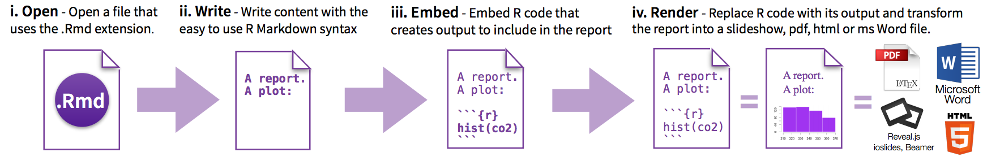

<!-- Software and Data Carpentry are both communities of volunteer researchers, educators, and more who develop lessons and teach two day workshops on basic computing and data skills for researchers. Software Carpentry focuses on helping researchers develop foundational computational skills; Data Carpentry focuses on helping researchers work effectively with their data through its lifecycle. -->

<!-- The main goal of these organizations is not to teach specific skills, per se - although those are covered - but rather, to convey best practices that will enable researchers to be more productive and do better research. -->

<!-- Just like learning a new language, a musical instrument, or a sport, teaching is a skill that requires practice and feedback. -->

<!-- The key tool for R is knitr, which allows you to create a document that is a mixture of text and some chunks of code. When the document is processed by knitr, chunks of R code will be executed, and graphs or other results inserted. -->

<!-- This sort of idea has been called “literate programming”. -->

<!-- <style type="text/css"> -->
<!-- ... -->
<!-- </style> -->


```{r setup, include = F}
knitr::opts_chunk$set(echo = T, message = F, error = F, warning = F)
```


```{r packages, echo = F, message = F, fig.height = .1}
source("src/semantic_ui.R")

pacman::p_load(rmarkdown, shiny, shiny.semantic, dplyr, ggplot2)
#library(shiny)
```


```{r echo = F, message = F, fig.height = .1}
shiny.semantic::uirender(sidebar())
```

[](https://github.com/sindresorhus/awesome)

**Note:** this is personal summary. Some other more strictly updated awsome projects. Inspired by

* [Awesome R](https://awesome-r.com/) 
* [Awesome Machine Learning](https://github.com/josephmisiti/awesome-machine-learning) 


The repository directory to this static html file is built as follows:

```{r, echo = T, message = F}
shiny.semantic::uirender(repo_structure())
```

# Intro

# Basic

How things get compiled? When you press the “Knit HTML” button, the R Markdown document is processed by knitr and a plain Markdown document is produced (as well as, potentially, a set of figure files): the R code is executed and replaced by both the input and the output; if figures are produced, links to those figures are included.

The Markdown and figure documents are then processed by the tool pandoc, which converts the Markdown file into an html file, with the figures embedded.


## YAML

Der YAML header bestimmt wie das Dokument kompeliert wird. 

    ---
    title: "HTML example"
    output: html_document
    ---


* [Overview of Output Formats](http://rmarkdown.rstudio.com/formats.html)


Zur Auswahl stehen verschiedene Standardformate. Some code and output. Neben diesen drei Typischen Formaten stehen Erweiterungen für HTML bereit.


```{r, echo = F}
library(knitr)
library(kableExtra)
library(dplyr)
dat <- rbind(
  c("html_document", "HTML"),
  c("pdf_document", "PDF"),
  c("word_document", "Microsoft Word (.docx)"),
  c("odt_document", "Open Document Text"),
  c("rtf_document", "Rich Text Format"),
  c("md_document", "Markdown (converts R to md)"),
  c("github_document", "Markdown (github special)"),
  c("ioslides_presentation", "ioslides (HTML 5 slideshow)"),
  c("slidy_presentation", "slidy (HTML 5 slideshow)"),
  c("beamer_presentation", "beamer (pdf slideshow)")
) %>% 
  as.data.frame() %>% 
  rename(Code = V1, Output = V2)

dat %>%
  formattable::format_table(caption = "Standard Outputs delivered by Rmarkdown")
```

## Markdown

### Überschriften 


    # 1. Überschrift (section)
    ## 2. Unterüberschrift (subsection)
    ### 3. Unterunterüberschrift (subsubsection)


### Listen

    * Item 1
    * Item 2
    * Item 3
        + Item 3.1
        + Item 3.2
    * Item 4
    
ergibt ...

* Item 1
* Item 2
* Item 3
    + Item 3.1
    + Item 3.2
* Item 4


### Text Highlighting

    *kurisver Text*
    **fetter Text**
    ~~durchgestrichener Text~~


ergibt

* *kurisver Text*
* **fetter Text**
* ~~durchgestrichener Text~~

### Formeln

Egal welches Output-Format, Rmd kann $\LaTeX$ Formeln ausgeben. Ein beiebiger Mittelwert beträgt $\bar x = 1.32$, während eine Regressionsmodell die Form annimmt:

$$y_i = \beta_0 + \beta_1 x_{1i} + \varepsilon_i $$

ganz einfach 

    $$y_i = \beta_0 + \beta_1 x_{1i} + \varepsilon_i $$


### Bilder 


Für HTML hat man auch die Möglichkeit *plain* (reines) HTML zu verwenden.


## R Markdown




    ```{r chunkname, echo=T}`r ''`
    1 + 1
    ```

Um ein Summary, Exzerpt oder Abstract zu schreiben und dabei die Möglichkeit zu haben sowohl Grafiken, Tabellen, Links als auch eigene Statistiken direkt mit einzubinden ist die Anwendung von `R Markdown` optimal. R Markdown ist eine Variante von [Markdown](http://kbroman.org/knitr_knutshell/pages/markdown.html) und ist wichtig für eine robuste und nachvollziebare Dokumentation wenn man Daten arbeitet. `R Markdown` wurde mit den Grundgedanken konzipiert, so einfach lesbar und schreibbar wie möglich zu sein.

`R Markdown` umfasst `R Code Chunks` und wird in Verbindung mit `knitr` verwendet um ganz einfach **tolle, reproducible, web-basierte Reports** zu erstellen. `knitr`ist ein `R package` welches den Zweck hat R-Code in `LaTex`Dokumente einzubinden. Hier spart man sich also das "copy-paste" und generiert reproducible research. Wenn ein Dokument `knit`wird, sendet R Markdown ein `.Rmd` - Dokument an `knitr`, was wiederum alle `R Code Chunks` ausführt und ein neues Markdown `.md` - Dokument (inklusiv Code und Output) erstellt. Anschließend wird das generierte Dokument mit Hilfe von `pandoc`, http://pandoc.org/, zum finalen Output abgewickelt. 

[mehr Infos zu `knitr`](https://yihui.name/knitr/)  

<!-- <center></center>   -->

Folgende Chunk Options können eingestellt werden:

| option     | default | effect                                                    |
|------------|---------|-----------------------------------------------------------|
| eval       | TRUE    | Whether to evaluate the code and include its results      |
| echo       | TRUE    | Whether to display code along with its results            |
| warning    | TRUE    | Whether to display warnings                               |
| error      | FALSE   |  Whether to display errors                                |
| message    | TRUE    | Whether to display messages                               |
| tidy       | FALSE   | Whether to reformat code in a tidy way when displaying it |
| results    | markup  | "markup", "asis", "hold", or "hide"                       |
| cache      | FALSE   | Whether to cache results for future renders               |
| comment    | ##      | Comment character to preface results with                 |
| fig.width  | 7       | Width in inches for plots created in chunk                |
| fig.height | 7       | Height in inches for plots created in chunk               |


# Output Formats

## PDF

## HTML

* [HTML Text Formatting **w3schools**](https://www.w3schools.com/html/html_formatting.asp)


## Flexdashboard

## Mindmaps

## Website

## Blogs

## Slides

## Books

## Music Notes


# Interactive Visuals

## Highcharter

<br>
<br>
<br>
<br>
<br>

# UI Extensions

## Semantic UI
<br>
<br>
<br>
<br>
<br>

<!-- <!--- tabset ---> -->
<!-- ## Sales Report {.tabset} -->
<!-- ### By Product -->

<!-- (tab content) -->

<!-- ### By Region -->

<!-- (tab content) -->

